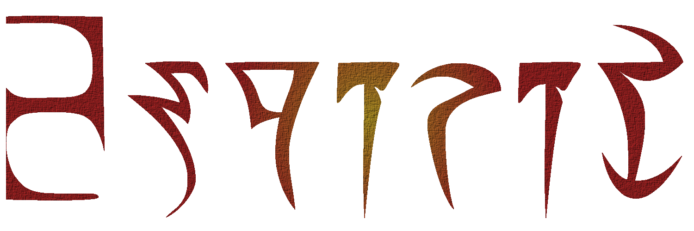

== Espirit

*Espirit* is simple parser of Morrowind .esp & .esm files, written entirely in
Nim language.

Currently, Espirit allows for complete read of Morrowind plugins and masters,
extracting its data into dedicated struct. The library is stable and tested,
although it may contain issues - in such case, please report them on link:https://github.com/Toma400/Espirit/issues[issues page]
or link:https://discord.gg/GbTw9KqnrE[Discord].

While the main goal of Espirit was reached, there is link:todo.adoc[a list of features I'd like to add]
which will dictate future development of the library, if I find time and will
to work on it further.  +
I plan on updating the library in terms of fixing issues and reviewing PRs
regardless of the above, so it can be ensured this library will be maintained
at least for a while.

=== Installing and use
You can install Espirit by using standard Nimble installation:
----
nimble install espirit
----
In code, simply import the library and use *newMWPlugin* proc:
[source,java]
----
import espirit

let esp = newMWPlugin("your_mod_file.esp")
----
*MWPlugin* is struct that collects all records from said file, allowing
you to get all the data. You can see code reference in *espirit.nim* file.
[source,ruby]
----
# stringified plugin yields dependencies and counts of all records
echo $esp

# shows information on all game settings (GMST)
for i in esp.gmst:
   echo i.info
----
All records' references are stored in *records.nim*.

*Note:* when parsing large files, using `-d:release` for your compiled
executable is recommended. I will search for ways for Espirit to be
faster when doing large file analysis.

=== License
Espirit is using MIT Non-AI License, that can be found link:license.adoc[here].

=== FAQ
Q: *Will other games (Oblivion, Skyrim, Fallout) be covered?* +
A: Not by me. If you want to make PR with their respective parsers, feel
   free to contribute.

Q: *Will saving, merging and other actions be available?* +
A: It's not planned at the moment. If either the plugin use by me becomes
   important part of my future development, or if the plugin gets enough
   attention, I can think about it. +
   Mind you that plugin merging and editing is covered by Construction Set
   and software like TESAME.